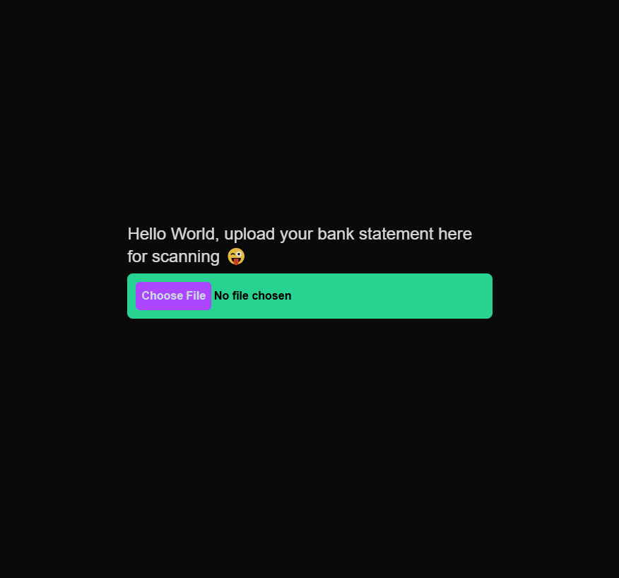
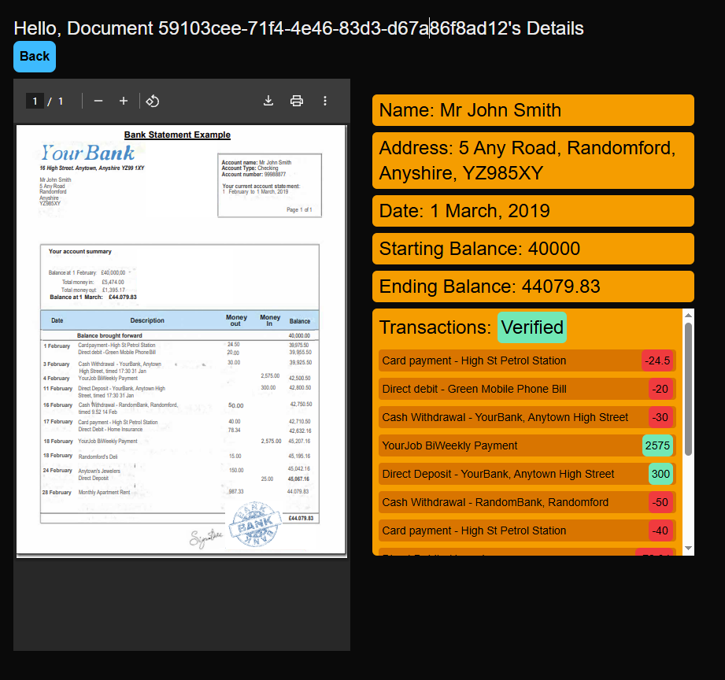

## NextJS Upload Bank Statement App

| Upload Page                          | History Page                          |
| ------------------------------------ | ------------------------------------- |
|  |  |

### How to run?

1. Copy sample env file.
   ```
   cp .env.sample .env
   ```
2. Edit `.env` file with your Anthropic API KEY.
   ```
   ANTHROPIC_API_KEY=<please-use-your-key-here>
   ```
3. For MacOS or Windows users who have Docker Desktop, please navigate to settings and file sharing, and add paths for, 
   - `/data/minio`
   - `/src`
4. Run with docker compose.
   ```
   docker compose --profile dev up # enable hot reload 1GB
   docker compose --profile prod up # or without hot reload 228MB
   ```
5. Test the app at `localhost:3000` with the PDF `Bank Statement Example Final.pdf` in the `resources` folder.
